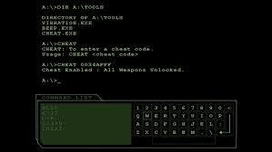

# matrix-keyboard-sounds

This is VSCode Extension that adds futuristic keypress sounds.

## Requirements

mplayer must be installed

## Installation

Run code --install-extension deans4.matrix-keyboard-sounds
or search Matrix Keyboard Sounds in the Marketplace.

## Extension Settings

* `matrix_keyboard_sounds.activate`: Enable this extension.
* `matrix_keyboard_sounds.deactivate`: Disable this extension.

## Contribution

Pull requests are welcome

### 1.0.0

Initial release of Matrix-Keyboard-Sounds

**Enjoy!**
